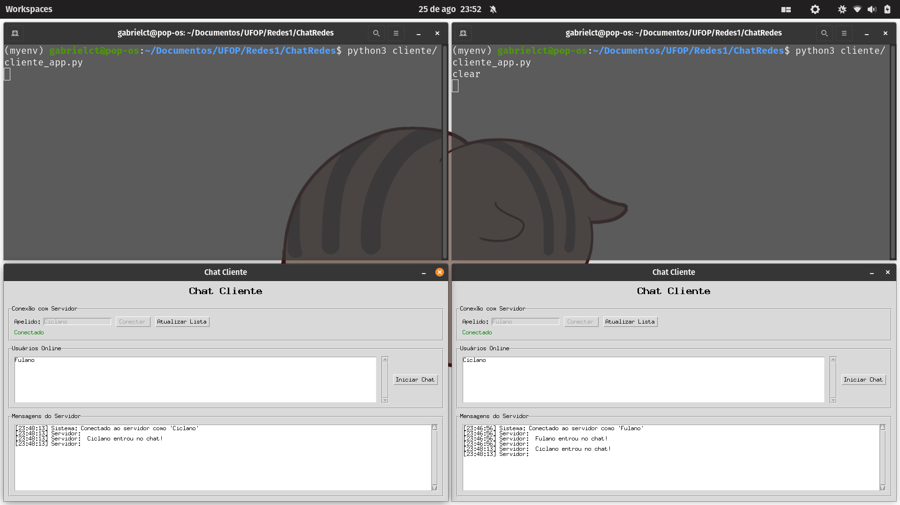

# TESTES REALIZADOS - SISTEMA DE CHAT

## 1. INTRODUÇÃO

Este documento descreve os testes realizados no sistema de chat desenvolvido, incluindo os resultados obtidos e análise dos mesmos. O sistema foi testado utilizando múltiplos clientes conectados simultaneamente ao servidor, com monitoramento de tráfego através do Wireshark.

## 2. AMBIENTE DE TESTE

- **Sistema Operacional**: Linux (Pop!_OS)
- **Linguagem**: Python 3
- **Protocolo**: TCP/IP
- **Porta do Servidor**: 2004

## 3. CASOS DE TESTE

### 3.1 Teste de Conexão Inicial

**Objetivo**: Verificar se o cliente consegue se conectar ao servidor e realizar o registro.

**Procedimento**:
1. Iniciar o servidor através do comando `python3 main.py`
2. Executar o cliente através do comando `python3 cliente/cliente_app.py`
3. Inserir um apelido no campo correspondente
4. Clicar no botão "Conectar"

**Resultado Obtido**:
- A conexão foi estabelecida com sucesso
- Interface foi atualizada corretamente
- Servidor registrou o cliente adequadamente

**Evidência**: 

---

### 3.2 Teste de Usuário Sozinho

**Objetivo**: Verificar o comportamento do sistema quando há apenas um usuário conectado.

**Procedimento**:
1. Conectar apenas um cliente ao servidor
2. Verificar a lista de usuários online
3. Tentar iniciar um chat

**Resultado Obtido**:
- Sistema exibiu corretamente que não há outros usuários online
- Lista de usuários permaneceu vazia
- Interface funcionou adequadamente

**Evidência**: 

---

### 3.3 Teste de Chat entre Múltiplos Usuários

**Objetivo**: Verificar a funcionalidade de chat entre múltiplos usuários conectados simultaneamente.

**Procedimento**:
1. Conectar múltiplos clientes ao servidor com apelidos diferentes
2. Verificar se todos aparecem na lista de usuários online
3. Iniciar conversas entre os usuários
4. Enviar mensagens em ambas as direções

**Resultado**:
- Múltiplos usuários conectados simultaneamente
- Lista de usuários atualizada em tempo real
- Chat funcionando bidirecionalmente
- Mensagens entregues com sucesso

**Evidência**: 

**Análise Wireshark**:
- Comandos MSG enviados corretamente
- Mensagens roteadas pelo servidor para os destinatários corretos
- Confirmações MSG_OK retornadas aos remetentes

---

### 3.4 Teste de Saída de Usuário

**Objetivo**: Verificar o comportamento do sistema quando um usuário se desconecta.

**Procedimento**:
1. Conectar múltiplos usuários
2. Desconectar um dos usuários (fechar aplicação)
3. Verificar se os outros usuários são notificados
4. Verificar atualização das listas de usuários online

**Resultado Obtido**:
- Usuário removido automaticamente das listas
- Notificação "usuário saiu do chat" exibida
- Sistema manteve estabilidade

**Evidência**: 

---

## 4. ANÁLISE DO TRÁFEGO DE REDE (WIRESHARK)

### 4.1 Captura do Protocolo de Comunicação

**Objetivo**: Monitorar e analisar o tráfego de rede entre cliente e servidor durante as operações de chat.

**Evidência**: 
**Evidência**: 

---